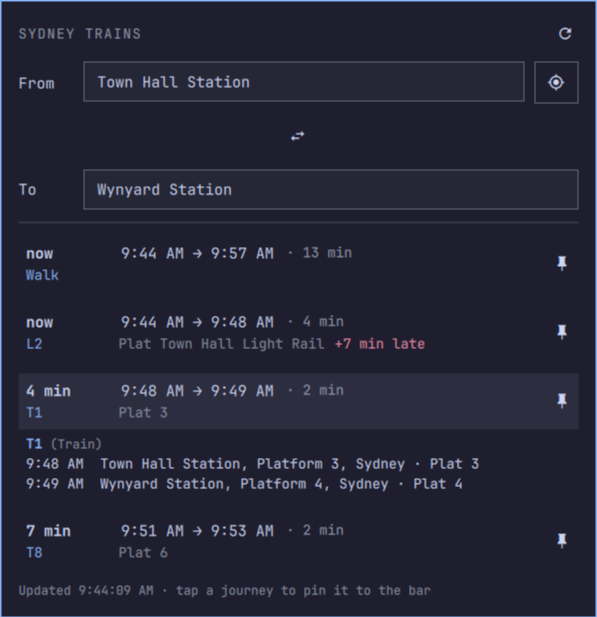

# Sydney Train Planner — Omarchy plugin

A bar widget for [Omarchy](https://omarchy.org) (Quattro shell) that plans a
Sydney / NSW public-transport trip right from the bar.

- **Bar pill** — live countdown to your next departure on a saved trip
  (` 6′ +3 · T1`), turning amber when the service is running late.
- **Planner popup** — search any origin and destination, use your current
  location, swap ends, and see the next few journeys with duration, line,
  platform, interchanges and real-time delays.
- Tap a journey to expand a leg-by-leg breakdown — every stop, platform,
  time and interchange wait along the way.
- Pin a trip's origin/destination pair as the bar's default with the 📌
  button on its row.

Data comes from the official [Transport for NSW Open Data](https://opendata.transport.nsw.gov.au)
Trip Planner API. **You bring your own free API key** — see below.



## Install

```sh
omarchy plugin add https://github.com/ozdadirri/omarchy-sydney-train-planer.git --enable
```

The plugin lands in `~/.config/omarchy/plugins/io.github.ozdadirri.sydney-train-planer/`.
Move it to another bar section with:

```sh
omarchy bar move io.github.ozdadirri.sydney-train-planer --section right
```

## Get a TfNSW API key (free, ~2 minutes)

1. Go to <https://opendata.transport.nsw.gov.au/> and **Sign up**, then verify
   your email.
2. Log in → **My Account** → **Applications** → **Create Application** (any
   name, e.g. `omarchy-syd-train`).
3. On that application, **add APIs** and tick **Trip Planner APIs**. That
   bundle covers everything this plugin calls (`stop_finder`, `trip`, `coord`).
4. Open the application → **API Keys** → copy the key.

## Configure

Either set it in the UI — **Setup → Plugins → Sydney Train Planner** — filling
in `apiKey` (and optionally a default origin/destination) —

**or** drop a file at `~/.local/state/omarchy/settings/syd-train.json`:

```json
{
  "apiKey": "YOUR_TFNSW_KEY",
  "originId": "",
  "originName": "",
  "destinationId": "",
  "destinationName": ""
}
```

Leave the origin/destination fields blank and just pick them in the popup —
tapping a journey pins it and fills these in automatically.

> The key is read at runtime and never leaves your machine. Do not commit a
> file that contains it; `.gitignore` already excludes `syd-train.json`.

## Usage

| Action | Result |
|---|---|
| Left-click pill | Open / close the planner |
| Middle-click pill | Force a refresh |
| Right-click pill | Desktop notification with the next departure |
| Type in From / To | Live stop search (min 3 characters) |
| ⌖ button | Fill From with the nearest stop to your IP location |
| ⇅ button | Swap From and To |
| Tap a journey | Expand its leg-by-leg detail (stops, platforms, times, interchange waits) |
| 📌 on a journey | Pin this trip's origin/destination as the bar default |

## Remove

```sh
omarchy plugin remove io.github.ozdadirri.sydney-train-planer
```


## License

MIT — see [LICENSE](LICENSE). Not affiliated with Transport for NSW.
